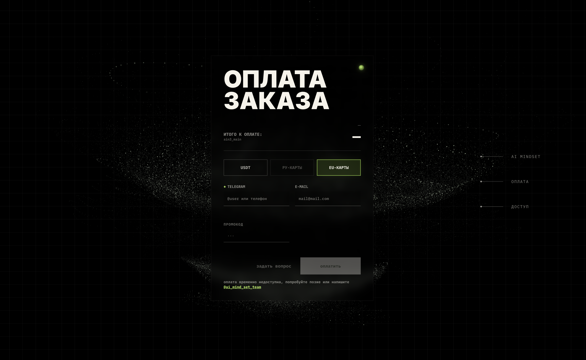
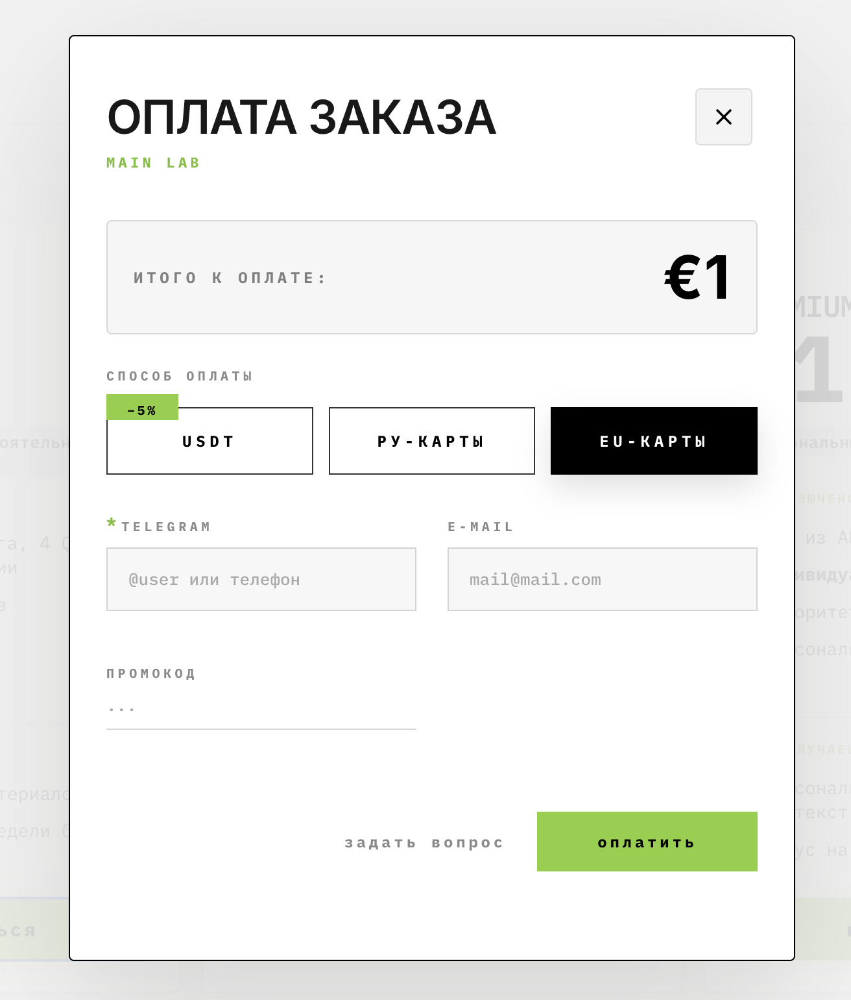

# Встраивание оплаты AI Mindset на лендинг

Два способа подключить оплату лаборатории на отдельном лендинге: обычная ссылка на страницу
`/pay` или попап-виджет поверх текущей страницы.

Платёжный поток (валюты, скидки, промокоды, alumni, Telegram, эквайер, проверка статуса оплаты)
полностью обслуживается на стороне AI Mindset. От лендинга нужно только вставить HTML — ни
JS-логики, ни обращений к API, ни ключей писать не нужно.

---

## Способ 1 — ссылка на страницу оплаты `/pay` (рекомендуется)

Подключите к кнопке оплаты на вашем вайб-кодинг-сайте обычную ссылку на `/pay`. В параметре
`product` укажите код тарифа из NocoDB. Пользователь перейдёт на отдельную страницу оплаты
AI Mindset; скрипты и API на вашем сайте не нужны.

Место, куда нужно вставить код тарифа: `https://staging.aimindset.org/pay?product=` **`КОД_ТАРИФА_ИЗ_NOCODB`**

После подстановки кода тарифа прикрепите **всю получившуюся ссылку** к кнопке оплаты на вашей странице.

Пример для тарифа S26: `https://staging.aimindset.org/pay?product=` **`s26_main`**

```html
<a href="https://staging.aimindset.org/pay?product=s26_main">Оплатить</a>
```

Опционально можно протащить отображаемое имя тарифа:

```html
<a href="https://staging.aimindset.org/pay?product=s26_main&plan_label=S26">Оплатить</a>
```

Стилизуйте ссылку как кнопку в дизайне вашего сайта.

[↓ Взять код нужного тарифа](#коды-тарифов)

**Страница оплаты `/pay`**



### Сурикат и контакты на странице `/pay`

Дополнительное подключение на лендинге не требуется: отправка контакта уже встроена в страницу
`https://staging.aimindset.org/pay/` и любых связанных с ней тарифов.

Сурикат получает только значение обязательного поля **Telegram** — username или номер телефона.

Контакт отправляется через 900 мс после остановки ввода. Отправка также срабатывает при уходе из
поля, скрытии или закрытии страницы и непосредственно перед нажатием «оплатить». Изменённый контакт
отправляется как новый для отлавливания быстрых вводов.

### Яндекс Метрика и UTM

На странице `/pay` уже подключён счётчик Яндекс Метрики `106857835`. Загрузка страницы, нажатие
«оплатить», переход к провайдеру и ошибка запуска оплаты до перехода к провайдеру отправляются в
этот счётчик как отдельные события. Они также записываются в технический журнал, чтобы можно было
диагностировать платёжный поток. Это не уведомления Суриката. Значения полей формы в эти
технические события не входят.

[Открыть отчёты AI Native / Payment в Яндекс Метрике](https://metrica.yandex.com/overview?id=106857835)

Для событий, которые происходят уже на `/pay`, отдельно подключать Метрику на лендинге не нужно.
Если нужно видеть просмотры самого лендинга и клики до перехода на оплату, аналитику этого лендинга
нужно подключить или проверить отдельно: платёжный счётчик не начинает автоматически отслеживать
другую страницу.

UTM-метки для новых страниц и мест публикации автоматически не создаются. Перед публикацией ссылки
вручную добавьте `utm_source`, `utm_medium`, `utm_campaign` и `utm_content`, затем внесите готовую
ссылку в `website-ops/utm-link-table.md`. Страница `/pay` сохранит переданные UTM для заказа, но не
придумает их сама.

---

## Способ 2 — попап-виджет (оплата без ухода со страницы)

Если нужно, чтобы оплата открывалась поверх лендинга (модальное окно), а не уводила на отдельную
страницу — подключите виджет. Это hosted-скрипт: файл живёт на сервере AI Mindset, лендинг лишь
ссылается на него тегом `<script src>`. Копировать сам файл к себе не нужно.

> **Важно: окружение.** Платёжный стек и попап-виджет сейчас работают через
> `https://staging.aimindset.org`. Когда виджет переведут в production, адрес изменится на стороне
> AI Mindset — код на лендингах менять не потребуется.

Прямой перехват контакта Сурикатом сейчас подтверждён только для отдельной страницы `/pay`.
Попап `/checkout` не отправляет введённый Telegram, e-mail или промокод в lead relay Суриката.

```html
<!-- 1. Подключить виджет один раз (в <head> или перед </body>) -->
<script src="https://staging.aimindset.org/widget/checkout.js" async></script>

<!-- 2. Любая CTA-кнопка тарифа: добавить data-aim-checkout + data-product -->
<button data-aim-checkout data-product="s26_main">Оплатить</button>
```

Клик по кнопке откроет попап оплаты в overlay-iframe. Стилизация кнопки — целиком на стороне
лендинга, виджет ничего не навязывает.

[↓ Взять код нужного тарифа](#коды-тарифов)

**Попап-виджет**



### Вариант: кнопка-виджет ведёт на страницу `/pay`

Если на части кнопок нужен попап, а на части — переход на страницу `/pay`, добавьте на кнопку
атрибут `data-aim-mode="page"`:

```html
<button data-aim-checkout data-product="s26_main" data-aim-mode="page">Оплатить</button>
```

---

## Коды тарифов

Коды тарифов хранятся в **NocoDB LMS Lab Config** в поле `product_code`. Для каждого тарифа нужен
свой код. Даник создаёт и подтверждает их. Кнопка копирования берёт только сам код — без пробелов
и кавычек.

| Лаборатория | `product_code` | Тариф | Цена | Статус из рабочих материалов |
| --- | --- | --- | --- | --- |
| S26 | `s26_main` | Main / Summer Lab Flow | €890 | Активен, публичный |
| AI-Native 3 | `ain3_mainearly` | Main Early Bird | €1690 | Активен, `admin_only` |
| AI-Native 3 | `ain3_main` | Main | €1990 | Активен, `admin_only` |
| AI-Native 3 | `ain3_teamearly` | Team Early | €1490 / участник | Активен, `admin_only` |
| AI-Native 3 | `ain3_team` | Team | €1690 / участник | Активен, `admin_only` |
| X26 | `x26_main` | Main | €890 | Найден в рабочих материалах; сверить активность в NocoDB |
| X26 | `x26_premium` | Premium | €1490 | Найден в рабочих материалах; сверить активность в NocoDB |
| Health | `health_main` | Main | €290 | Найден в рабочих материалах; сверить активность в NocoDB |
| Health | `health_early` | Early Bird | €190 | Был `admin_only`; сверить у Даника |
| Self Development | `self-dev_main` | Main | €490 | Найден в рабочих материалах; сверить активность в NocoDB |

Перед публикацией новой лаборатории сверяйте код, цену и активность с Даником: актуальный источник — NocoDB.

### Если цена не подтянулась или появилась ошибка кода тарифа

1. Сверьте `product` или `data-product` посимвольно с кодом, который подтвердил Даник. Код должен быть в нижнем регистре.
2. Если лаборатория новая, код неизвестен или записи ещё нет в NocoDB — напишите Данику (`@dan_named`). Он заводит продукт и его код в NocoDB.
3. Если код не существует, цена не загрузится и оплата не пройдёт.
4. Если Даник подтвердил код и запись в NocoDB, но цена всё равно не загружается, передайте ему скриншот ошибки и адрес страницы: нужно проверить платёжный бэкенд или прокси.

Весь бэкенд кодов продуктов находится на стороне Даника. Лендинг не должен обращаться в NocoDB
напрямую и не должен хранить ключи базы.

---

## Дополнительные настройки попапа

Для обычной ссылки из Способа 1 этот раздел не нужен. Для попапа достаточно двух обязательных
атрибутов — `data-aim-checkout` и `data-product`. Остальные настройки подключаются только при
необходимости.

### Атрибуты CTA-кнопки

| Атрибут | Обязательность | Что делает |
| --- | --- | --- |
| `data-aim-checkout` | Обязателен для попапа | Маркер кнопки, которая открывает виджет |
| `data-product="<code>"` | Обязателен для попапа | Код тарифа из поля `product_code` |
| `data-plan-label="<текст>"` | Опционально | Имя тарифа в попапе; без атрибута берётся из каталога |
| `data-aim-mode="page"` | Опционально | Вместо попапа открывает отдельную страницу `/pay` |

### Автоподстановка цены

Виджет может сам подставить актуальную цену из каталога AI Mindset. Добавьте `data-aim-price` и
`data-product` на элемент с ценой:

```html
<div class="tariff-card">
    <div class="price">
        <span data-aim-price data-product="s26_main">€890</span>
    </div>
    <button data-aim-checkout data-product="s26_main">Оплатить</button>
</div>
```

Виджет при загрузке страницы делает один запрос, находит все `[data-aim-price]` и заменяет их
содержимое актуальной ценой. Рублёвая цена — `data-currency="rub"` (по умолчанию `eur`):

```html
<span data-aim-price data-product="s26_main" data-currency="rub">…</span>
```

Если карточки тарифов рендерятся динамически (React/Vue и т.п.) и цены не подставились — после
ре-рендера вызовите `AIM.refreshPrices()`.

### Программный API для динамических лендингов

Если кнопки рендерятся скриптом и data-атрибуты не отрабатывают — управляйте виджетом из кода:

```html
<script>
  // Открыть попап вручную
  AIM.openCheckout({ product: 's26_main', planLabel: 'S26 · Main' });

  // Перечитать цены в data-aim-price после ре-рендера карточек
  AIM.refreshPrices();

  // Колбэк при создании заказа и редиректе на эквайер (опционально)
  AIM.onSuccess = function (orderId) {
    // ВАЖНО: вызывается в момент, когда попап создал заказ и редиректит пользователя
    // на платёжку (Stripe/Moneta/OxaPay), а НЕ при фактической оплате. Финальный статус
    // оплаты проверяется уже на странице возврата AI Mindset, внутри iframe его не будет.
    console.log('Создан заказ:', orderId);
  };
</script>
```

Контракт data-атрибутов и API (`AIM.openCheckout`, `AIM.refreshPrices`, `AIM.onSuccess`) —
стабильный, ломаться без анонса не будет.

### Content-Security-Policy

Если на лендинге **не задан** CSP — пропустите этот раздел, всё работает. Если CSP **задан** —
добавьте домен AI Mindset в директивы (нужно для Способа 2 и автоцен):

```
script-src  https://staging.aimindset.org;
frame-src   https://staging.aimindset.org;
connect-src https://staging.aimindset.org;
```

Способ 1 (ссылка `/pay`) работает и при строгом CSP — это обычный переход по ссылке.

---

## Эксплуатация и проверка

### FAQ

**Карточки появляются динамически, цены не подставились.** Виджет подставляет цены один раз при
загрузке страницы. Если карточки добавились позже — вызовите `AIM.refreshPrices()`.

**Как поменять стиль кнопки?** Никак не нужно — виджет ничего не диктует, стилизация целиком на
стороне лендинга.

**Можно ли встраивать на Tilda / Webflow / любой конструктор?** Да, везде, где можно вставить
`<script>` и HTML с атрибутами. Виджет — vanilla JS без зависимостей.

**Открыть попап не по клику, а из роутера / по параметру в URL?** Вызовите `AIM.openCheckout({
product: 's26_main' })` из своего кода (например, на `?buy=1` в адресе).

### Версионирование и кэш

Одна стабильная версия по адресу `https://staging.aimindset.org/widget/checkout.js`. Обновления
(фиксы, новые фичи попапа) разъезжаются автоматически — менять тег у себя не нужно.

Файл кэшируется CDN (~4 часа). После выкатки фикса на стороне AI Mindset заложите до ~4 часов на
распространение. На время **проверки** можно форсировать свежую версию, добавив любой query-параметр
к ссылке (отдельный ключ кэша):

```html
<script src="https://staging.aimindset.org/widget/checkout.js?v=2" async></script>
```

### Проверка

1. **Способ 1:** кликнуть ссылку — должна открыться страница оплаты `https://staging.aimindset.org/pay?product=…`.
2. **Способ 2:** кликнуть кнопку — должен открыться попап. Если не открылся:
   - открыть DevTools → Console на предмет warning'ов виджета;
   - открыть DevTools → Network: должен быть запрос на `https://staging.aimindset.org/api/payment/site-list-products`;
   - проверить, что `data-product` совпадает с кодом, который подтвердил Dan;
   - при заданном CSP — проверить директивы из раздела выше.

### Другое окружение

Виджет по умолчанию работает против staging, поэтому обычному встраиванию этот раздел не нужен.
Если для локальной разработки или другого окружения требуется перенацелить виджет — задайте
`window.AIM_ORIGIN_OVERRIDE` **до** тега `<script src>`:

```html
<script>window.AIM_ORIGIN_OVERRIDE = 'http://localhost:4331';</script>
<script src="https://staging.aimindset.org/widget/checkout.js" async></script>
```

---

Виджет встраивается куда угодно, где можно вставить `<script>` и HTML. Ошибки кода продукта,
отсутствующую цену и новую лабораторию передавайте Данику (`@dan_named`).
